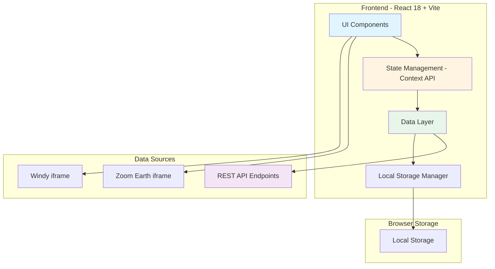

# Design Document: Cyclone Awareness Dashboard

## Overview

The Cyclone Awareness Dashboard is a React 18-based single-page application built with Vite that provides real-time cyclone risk information for Chennai and surrounding districts. The application follows a component-based architecture with clear separation between data fetching, state management, and presentation layers. The system uses a combination of REST API calls for structured data and iframe embeds for live visualization services (Zoom Earth, Windy). All user preferences and saved data are stored locally using the browser's Local Storage API, ensuring privacy and offline capability.

The application is designed to be responsive across mobile, tablet, and desktop devices, with accessibility features meeting WCAG 2.1 Level AA standards. The dashboard supports bilingual operation (English and Tamil) with automatic language detection and persistent user preferences.

## Architecture

### High-Level Architecture



### Component Architecture

The application follows a hierarchical component structure:

```
App
├── LanguageProvider (Context)
├── DataProvider (Context)
│   ├── API Client
│   ├── Cache Manager
│   └── Rate Limiter
├── Header
│   ├── LanguageSelector
│   └── SystemStatus
├── CycloneMap
│   ├── PathwayVisualization
│   ├── DistrictOverlay
│   └── LiveMapEmbed (Zoom Earth/Windy)
├── DistrictRiskPanel
│   ├── RainfallDisplay
│   ├── FloodingRisk
│   └── SeverityIndicator
├── HolidayPredictor
├── TravelRouteChecker
│   ├── RouteInput
│   ├── RouteAnalysis
│   └── SafetyRecommendation
├── UpdatesFeed
│   ├── BulletinList
│   └── UpdateItem
├── PreparationChecklist
│   └── ChecklistItem
└── Footer
    ├── DataProvenance
    └── PrivacyNotice
```

### Technology Stack

- **Frontend Framework**: React 18 with functional components and hooks
- **Build Tool**: Vite for fast development and optimized production builds
- **Styling**: TailwindCSS for utility-first responsive design
- **Mapping**: Leaflet.js for interactive maps with district overlays
- **State Management**: React Context API for global state
- **Data Fetching**: Native Fetch API with custom caching layer
- **Storage**: Browser Local Storage API
- **Testing**: Vitest for unit tests, fast-check for property-based testing
- **Accessibility**: react-aria for accessible UI components
- **Internationalization**: Custom i18n implementation for English/Tamil

## Components and Interfaces

### Core Components

#### 1. DataProvider Component

Manages all data fetching, caching, and state distribution.

```typescript
interface CycloneData {
  id: string;
  name: string;
  pathway: Coordinate[];
  currentPosition: Coordinate;
  windSpeed: number;
  pressure: number;
  category: 'depression' | 'cyclone' | 'severe-cyclone' | 'super-cyclone';
  lastUpdated: Date;
}

interface DistrictRisk {
  districtId: string;
  districtName: string;
  rainfallEstimate: number; // in mm
  floodingProbability: RiskLevel;
  waterloggingRisk: RiskLevel;
  windImpact: RiskLevel;
  severityScore: number; // 0-10
  severityColor: 'yellow' | 'orange' | 'red';
}

interface HolidayPrediction {
  date: Date;
  probability: 'low-risk' | 'possible' | 'likely';
  confidence: number; // 0-100
  factors: {
    rainfallIntensity: number;
    windSpeed: number;
    alertLevel: string;
  };
}

interface TravelRouteAnalysis {
  source: string;
  destination: string;
  affectedDistricts: string[];
  maxRainfall: number;
  disruptionWindows: TimeWindow[];
  recommendation: 'safe' | 'caution' | 'avoid-travel';
  riskSegments: RouteSegment[];
}

interface Update {
  id: string;
  type: 'imd-bulletin' | 'rainfall-alert' | 'govt-announcement' | 'service-advisory';
  title: string;
  content: string;
  source: string;
  timestamp: Date;
}

type RiskLevel = 'low' | 'moderate' | 'high';

interface Coordinate {
  lat: number;
  lng: number;
}

interface TimeWindow {
  start: Date;
  end: Date;
  severity: RiskLevel;
}

interface RouteSegment {
  districtId: string;
  districtName: string;
  riskLevel: RiskLevel;
}
```

#### 2. API Client

Handles all REST API communication with error handling and retry logic.

```typescript
interface APIClient {
  getCurrentCyclone(): Promise<CycloneData>;
  getDistrictRainfall(): Promise<DistrictRisk[]>;
  getGovernmentAlerts(): Promise<Update[]>;
  getIMDBulletins(): Promise<Update[]>;
  analyzeTravelRoute(source: string, destination: string): Promise<TravelRouteAnalysis>;
  getRiskSummary(): Promise<RiskSummary>;
  getFullDashboard(): Promise<DashboardData>;
}

interface RiskSummary {
  overallSeverity: number;
  affectedDistricts: number;
  highRiskDistricts: string[];
  activeAlerts: number;
}

interface DashboardData {
  cyclone: CycloneData;
  districts: DistrictRisk[];
  holidayPrediction: HolidayPrediction;
  updates: Update[];
  riskSummary: RiskSummary;
}
```

#### 3. Cache Manager

Implements caching strategy with TTL and freshness indicators.

```typescript
interface CacheEntry<T> {
  data: T;
  timestamp: Date;
  ttl: number; // in milliseconds
}

interface CacheManager {
  get<T>(key: string): CacheEntry<T> | null;
  set<T>(key: string, data: T, ttl: number): void;
  isValid(key: string): boolean;
  getFreshness(key: string): 'fresh' | 'stale-yellow' | 'stale-orange' | 'stale-red';
  clear(key?: string): void;
}

// Cache TTL Configuration
const CACHE_CONFIG = {
  cycloneData: 5 * 60 * 1000, // 5 minutes
  districtRainfall: 5 * 60 * 1000, // 5 minutes
  updates: 5 * 60 * 1000, // 5 minutes
  travelRoute: 10 * 60 * 1000, // 10 minutes
};

// Freshness Thresholds
const FRESHNESS_THRESHOLDS = {
  fresh: 15 * 60 * 1000, // 15 minutes
  yellow: 30 * 60 * 1000, // 30 minutes
  orange: 60 * 60 * 1000, // 60 minutes
};
```

#### 4. Rate Limiter

Prevents excessive API calls.

```typescript
interface RateLimiter {
  canMakeRequest(endpoint: string): boolean;
  recordRequest(endpoint: string): void;
  getRemainingRequests(endpoint: string): number;
}

// Rate Limit Configuration: 12 requests per hour per endpoint
const RATE_LIMIT_CONFIG = {
  maxRequests: 12,
  windowMs: 60 * 60 * 1000, // 1 hour
};
```

#### 5. Local Storage Manager

Manages persistent storage with automatic cleanup.

```typescript
interface StorageManager {
  saveLastCyclone(cycloneId: string): void;
  getLastCyclone(): string | null;
  saveRoute(route: SavedRoute): void;
  getSavedRoutes(): SavedRoute[];
  deleteRoute(routeId: string): void;
  saveChecklistState(state: ChecklistState): void;
  getChecklistState(): ChecklistState;
  saveLanguagePreference(lang: 'en' | 'ta'): void;
  getLanguagePreference(): 'en' | 'ta' | null;
  clearOldData(maxAgeMs: number): void;
  clearAll(): void;
  getStorageSize(): number;
}

interface SavedRoute {
  id: string;
  source: string;
  destination: string;
  savedAt: Date;
}

interface ChecklistState {
  items: Record<string, boolean>;
  lastUpdated: Date;
}

// Storage limits
const STORAGE_CONFIG = {
  maxAgeMs: 30 * 24 * 60 * 60 * 1000, // 30 days
  maxSizeBytes: 5 * 1024 * 1024, // 5MB
};
```

#### 6. Severity Calculator

Unified algorithm for calculating severity scores.

```typescript
interface SeverityCalculator {
  calculateDistrictSeverity(
    rainfall: number,
    windSpeed: number,
    floodingRisk: RiskLevel
  ): SeverityResult;
  
  combineRiskFactors(factors: RiskFactor[]): number;
  
  getSeverityColor(score: number): 'yellow' | 'orange' | 'red';
}

interface SeverityResult {
  score: number; // 0-10
  color: 'yellow' | 'orange' | 'red';
  level: RiskLevel;
}

interface RiskFactor {
  type: 'rainfall' | 'wind' | 'flooding';
  value: number;
  weight: number;
}

// Severity Scoring Algorithm
// Score = (rainfall_normalized * 0.4) + (wind_normalized * 0.3) + (flooding_risk * 0.3)
// Normalization: rainfall (0-500mm -> 0-10), wind (0-200kmh -> 0-10)
// Color mapping: 0-3.9 = yellow, 4-6.9 = orange, 7-10 = red
```

### UI Components

#### 7. CycloneMap Component

Displays interactive map with cyclone pathway and district overlays.

```typescript
interface CycloneMapProps {
  cycloneData: CycloneData;
  districtRisks: DistrictRisk[];
  showLiveEmbed?: boolean;
  embedSource?: 'zoom-earth' | 'windy';
}

// Map Configuration
const MAP_CONFIG = {
  defaultCenter: { lat: 13.0827, lng: 80.2707 }, // Chennai
  defaultZoom: 8,
  minZoom: 6,
  maxZoom: 12,
};
```

#### 8. TravelRouteChecker Component

Allows users to input routes and see safety analysis.

```typescript
interface TravelRouteCheckerProps {
  onAnalyze: (source: string, destination: string) => void;
  analysis: TravelRouteAnalysis | null;
  loading: boolean;
}
```

#### 9. UpdatesFeed Component

Displays chronological list of bulletins and alerts.

```typescript
interface UpdatesFeedProps {
  updates: Update[];
  autoRefresh?: boolean;
  refreshInterval?: number; // in ms
}
```

#### 10. PreparationChecklist Component

Interactive checklist with persistent state.

```typescript
interface PreparationChecklistProps {
  items: ChecklistItem[];
  checkedItems: Record<string, boolean>;
  onToggle: (itemId: string) => void;
}

interface ChecklistItem {
  id: string;
  category: 'water' | 'power' | 'emergency' | 'supplies';
  text: string;
  priority: 'essential' | 'recommended' | 'optional';
}
```

## Data Models

### Cyclone Event Model

```typescript
class CycloneEvent {
  id: string;
  name: string;
  pathway: Coordinate[];
  currentPosition: Coordinate;
  windSpeed: number;
  pressure: number;
  category: CycloneCategory;
  lastUpdated: Date;
  
  constructor(data: CycloneData) {
    // Initialize from API data
  }
  
  isActive(): boolean {
    const hoursSinceUpdate = (Date.now() - this.lastUpdated.getTime()) / (1000 * 60 * 60);
    return hoursSinceUpdate < 24;
  }
  
  getIntensityLevel(): 'low' | 'moderate' | 'high' | 'extreme' {
    if (this.windSpeed < 62) return 'low';
    if (this.windSpeed < 88) return 'moderate';
    if (this.windSpeed < 118) return 'high';
    return 'extreme';
  }
}
```

### District Model

```typescript
class District {
  id: string;
  name: string;
  nameLocal: string; // Tamil name
  coordinates: Coordinate[];
  rainfallEstimate: number;
  floodingProbability: RiskLevel;
  waterloggingRisk: RiskLevel;
  windImpact: RiskLevel;
  severityScore: number;
  severityColor: 'yellow' | 'orange' | 'red';
  lastUpdated: Date;
  
  constructor(data: DistrictRisk) {
    // Initialize from API data
  }
  
  isHighRisk(): boolean {
    return this.severityScore >= 7;
  }
  
  getDisplayName(language: 'en' | 'ta'): string {
    return language === 'ta' ? this.nameLocal : this.name;
  }
}
```

### Travel Route Model

```typescript
class TravelRoute {
  source: string;
  destination: string;
  affectedDistricts: District[];
  maxRainfall: number;
  disruptionWindows: TimeWindow[];
  recommendation: 'safe' | 'caution' | 'avoid-travel';
  riskSegments: RouteSegment[];
  
  constructor(analysis: TravelRouteAnalysis, districts: District[]) {
    // Initialize from analysis data
  }
  
  isSafe(): boolean {
    return this.recommendation === 'safe';
  }
  
  getHighRiskSegments(): RouteSegment[] {
    return this.riskSegments.filter(seg => seg.riskLevel === 'high');
  }
  
  getCurrentDisruptionLevel(): RiskLevel | null {
    const now = new Date();
    const activeWindow = this.disruptionWindows.find(
      w => w.start <= now && w.end >= now
    );
    return activeWindow?.severity || null;
  }
}
```

## Error Handling

### Error Types

```typescript
enum ErrorType {
  NETWORK_ERROR = 'NETWORK_ERROR',
  API_ERROR = 'API_ERROR',
  RATE_LIMIT_ERROR = 'RATE_LIMIT_ERROR',
  VALIDATION_ERROR = 'VALIDATION_ERROR',
  STORAGE_ERROR = 'STORAGE_ERROR',
  UNKNOWN_ERROR = 'UNKNOWN_ERROR',
}

class DashboardError extends Error {
  type: ErrorType;
  statusCode?: number;
  retryable: boolean;
  
  constructor(type: ErrorType, message: string, retryable: boolean = false) {
    super(message);
    this.type = type;
    this.retryable = retryable;
  }
}
```

### Error Handling Strategy

1. **Network Failures**: Display last cached data with timestamp, show offline indicator, retry after 2 minutes
2. **API Errors (4xx)**: Log error, show user-friendly message, don't retry
3. **API Errors (5xx)**: Log error, show user-friendly message, retry with exponential backoff
4. **Rate Limit Exceeded**: Serve cached data, show notification, wait until rate limit window resets
5. **Validation Errors**: Show inline error messages, prevent form submission
6. **Storage Quota Exceeded**: Clear old data automatically, notify user
7. **Missing Data**: Show placeholder with explanation, offer manual refresh

### Retry Logic

```typescript
interface RetryConfig {
  maxRetries: number;
  initialDelayMs: number;
  maxDelayMs: number;
  backoffMultiplier: number;
}

const DEFAULT_RETRY_CONFIG: RetryConfig = {
  maxRetries: 3,
  initialDelayMs: 2000,
  maxDelayMs: 30000,
  backoffMultiplier: 2,
};

async function fetchWithRetry<T>(
  fetchFn: () => Promise<T>,
  config: RetryConfig = DEFAULT_RETRY_CONFIG
): Promise<T> {
  // Implement exponential backoff retry logic
}
```

### Error Boundaries

```typescript
class ErrorBoundary extends React.Component<Props, State> {
  // Catch React component errors
  // Display fallback UI
  // Log errors to console
}
```

## Testing Strategy

### Unit Testing

Unit tests will be written using Vitest to verify specific component behaviors and edge cases:

- **Component Rendering**: Test that components render correctly with various props
- **User Interactions**: Test button clicks, form submissions, route inputs
- **Data Transformations**: Test severity calculations, date formatting, unit conversions
- **Error Handling**: Test error boundary behavior, API error responses
- **Storage Operations**: Test Local Storage read/write/clear operations
- **Cache Logic**: Test cache hit/miss, TTL expiration, freshness indicators
- **Language Switching**: Test English/Tamil text rendering
- **Accessibility**: Test keyboard navigation, ARIA attributes, screen reader compatibility

Example unit tests:
- Test that empty route input shows validation error
- Test that severity score of 8.5 returns 'red' color
- Test that data older than 30 minutes shows orange freshness indicator
- Test that Local Storage clears entries older than 30 days

### Property-Based Testing

Property-based tests will be written using fast-check to verify universal properties across all inputs. The testing framework will be configured to run a minimum of 100 iterations per property test.

Each property-based test will include a comment tag in this format:
```typescript
// **Feature: cyclone-awareness-dashboard, Property {number}: {property_text}**
```

Property-based tests will verify:
- **Data Consistency**: Properties that ensure data transformations preserve invariants
- **Calculation Correctness**: Properties that verify severity scoring algorithms work correctly for all input ranges
- **Round-Trip Properties**: Properties that verify serialization/deserialization to Local Storage
- **Boundary Conditions**: Properties that verify edge cases in rainfall, wind speed, and time calculations
- **UI State Consistency**: Properties that verify UI state remains consistent after user interactions

Each correctness property from the design document will be implemented by a single property-based test.


## Correctness Properties

*A property is a characteristic or behavior that should hold true across all valid executions of a system—essentially, a formal statement about what the system should do. Properties serve as the bridge between human-readable specifications and machine-verifiable correctness guarantees.*

### Property 1: Severity color classification consistency

*For any* district with a severity score, the color classification (yellow/orange/red) should match the score range: 0-3.9 = yellow, 4-6.9 = orange, 7-10 = red.

**Validates: Requirements 1.3, 12.2**

### Property 2: District impact data completeness

*For any* district in an impact zone, when wind speed or rainfall data is available, that data should be displayed in the district's information panel.

**Validates: Requirements 1.4, 1.5, 2.1**

### Property 3: Risk level tag mapping

*For any* flooding probability or waterlogging risk value, the displayed risk level tag should correctly map to one of the three valid values: Low, Moderate, or High.

**Validates: Requirements 2.3**

### Property 4: Holiday prediction label validity

*For any* calculated holiday probability, the displayed prediction label should be one of the three valid values: Low Risk, Possible, or Likely.

**Validates: Requirements 3.2**

### Property 5: Route district intersection completeness

*For any* travel route between two locations, all districts that geographically intersect the route path should be identified in the analysis results.

**Validates: Requirements 4.2**

### Property 6: Route safety recommendation validity

*For any* travel route analysis, the safety recommendation should be exactly one of the three valid values: Safe, Caution, or Avoid Travel.

**Validates: Requirements 4.5**

### Property 7: Updates chronological ordering

*For any* list of updates (bulletins, alerts, announcements), the displayed order should be sorted by timestamp in descending chronological order (newest first).

**Validates: Requirements 5.1**

### Property 8: Update metadata completeness

*For any* displayed update item, both timestamp and source attribution should be present in the rendered output.

**Validates: Requirements 5.6, 11.1, 11.2**

### Property 9: Local Storage round-trip consistency

*For any* user data (cyclone ID, saved route, checklist state, language preference), storing the data to Local Storage and then retrieving it should return an equivalent value.

**Validates: Requirements 6.5, 6.6, 7.1, 7.2, 7.3, 7.4, 15.5**

### Property 10: Local Storage cleanup by age

*For any* Local Storage data with a timestamp older than 30 days, the cleanup function should remove that data while preserving newer entries.

**Validates: Requirements 7.5**

### Property 11: Responsive layout adaptation

*For any* screen width (320px to 3840px), the dashboard layout should adapt appropriately: mobile layout for <768px, tablet layout for 768-1024px, desktop layout for >1024px.

**Validates: Requirements 8.2, 8.3, 8.4**

### Property 12: Network error graceful handling

*For any* network failure or API error, the dashboard should not crash and should either display cached data or show an appropriate error message.

**Validates: Requirements 9.2, 9.3**

### Property 13: API response validation

*For any* API response received, the response structure should be validated against the expected schema before processing, rejecting invalid responses.

**Validates: Requirements 10.9**

### Property 14: Data staleness indicator accuracy

*For any* data element with a timestamp, the freshness indicator should correctly reflect the age: fresh (<15min), yellow (15-30min), orange (30-60min), red (>60min).

**Validates: Requirements 11.3, 14.2, 14.3, 14.4**

### Property 15: Severity score calculation consistency

*For any* district with wind speed, rainfall, and flooding risk values, the severity score calculation should use the unified algorithm: (rainfall_normalized * 0.4) + (wind_normalized * 0.3) + (flooding_risk * 0.3), producing a score between 0 and 10.

**Validates: Requirements 12.1, 12.3**

### Property 16: Cache TTL enforcement

*For any* cached API response, if the cache age is less than the TTL (5 minutes), the cached data should be served instead of making a new API request.

**Validates: Requirements 13.1, 13.2**

### Property 17: Rate limit enforcement

*For any* API endpoint, if 12 requests have been made within the past hour, additional requests should be blocked and cached data should be served instead.

**Validates: Requirements 13.3, 13.4**

### Property 18: Manual refresh cache bypass

*For any* manual refresh action, the cache should only be bypassed if the cached data is older than 2 minutes; otherwise, cached data should be served.

**Validates: Requirements 13.6**

### Property 19: Language selection text transformation

*For any* UI text element, selecting Tamil language should display Tamil text, and selecting English language should display English text, with all text elements updating consistently.

**Validates: Requirements 15.1, 15.3**

### Property 20: Browser language detection

*For any* browser language setting, if the browser language is Tamil (ta or ta-IN), the dashboard should default to Tamil; otherwise, it should default to English.

**Validates: Requirements 15.6**

### Property 21: Accessibility text labels for colors

*For any* color-coded severity indicator, a corresponding text label should be present in addition to the color, ensuring non-visual understanding.

**Validates: Requirements 16.2**

### Property 22: Local Storage data type restriction

*For any* data stored in Local Storage, it should only be one of the allowed types: user preferences, saved routes, or checklist states, with no personally identifiable information.

**Validates: Requirements 17.2, 17.3**

### Property 23: Storage quota management

*For any* Local Storage state, if the total size exceeds 5MB, the oldest entries should be automatically removed until the size is below the limit.

**Validates: Requirements 17.5**

### Property 24: Error logging completeness

*For any* error encountered during dashboard operation, error details should be logged to the browser console with sufficient information for debugging.

**Validates: Requirements 18.1**

### Property 25: Health check failure identification

*For any* failed API endpoint during health check, that specific endpoint should be identified and listed in the unavailable services display.

**Validates: Requirements 18.5**

### Property 26: Multiple hazard display completeness

*For any* district affected by multiple hazards (storm surge, landslide, flooding), all applicable hazard warnings should be displayed in the district information.

**Validates: Requirements 19.5**


## Performance Considerations

### Optimization Strategies

1. **Code Splitting**: Use React.lazy() and Suspense to split the application into chunks:
   - Main dashboard view
   - Travel route checker (loaded on demand)
   - Preparation checklist (loaded on demand)
   - Map visualization components

2. **Memoization**: Use React.memo() for expensive components:
   - District list rendering
   - Map overlays
   - Updates feed items

3. **Virtual Scrolling**: Implement virtual scrolling for long lists:
   - Updates feed with many bulletins
   - District list with 30+ districts

4. **Image Optimization**: 
   - Use WebP format with fallbacks
   - Lazy load images below the fold
   - Implement responsive images with srcset

5. **API Response Caching**: 
   - Cache all API responses for minimum 5 minutes
   - Use stale-while-revalidate pattern for background updates

6. **Bundle Size Optimization**:
   - Tree-shake unused TailwindCSS classes
   - Use production builds of React
   - Minimize third-party dependencies

### Performance Targets

- **Initial Load**: < 3 seconds on 3G connection
- **Time to Interactive**: < 5 seconds on 3G connection
- **First Contentful Paint**: < 1.5 seconds
- **Largest Contentful Paint**: < 2.5 seconds
- **Bundle Size**: < 200KB gzipped (main bundle)

## Security Considerations

### Data Security

1. **No Sensitive Data Storage**: Local Storage contains only non-sensitive user preferences
2. **API Communication**: All API calls should use HTTPS in production
3. **Input Validation**: Sanitize all user inputs (location names, route queries)
4. **XSS Prevention**: Use React's built-in XSS protection, avoid dangerouslySetInnerHTML
5. **Content Security Policy**: Implement CSP headers to prevent injection attacks

### Privacy

1. **No Tracking**: No analytics or tracking scripts
2. **No Third-Party Data Sharing**: All data stays local or with configured API
3. **Clear Privacy Notice**: Display privacy information on first load
4. **User Control**: Provide clear data deletion functionality

## Deployment Strategy

### Build Configuration

```javascript
// vite.config.js
export default {
  build: {
    target: 'es2015',
    outDir: 'dist',
    sourcemap: false,
    minify: 'terser',
    rollupOptions: {
      output: {
        manualChunks: {
          'react-vendor': ['react', 'react-dom'],
          'map-vendor': ['leaflet'],
        },
      },
    },
  },
  optimizeDeps: {
    include: ['react', 'react-dom', 'leaflet'],
  },
};
```

### Hosting Options

1. **GitHub Pages**: Free static hosting, automatic deployment from main branch
2. **Vercel**: Zero-config deployment, automatic HTTPS, global CDN
3. **Netlify**: Similar to Vercel with additional features

### Environment Configuration

```typescript
interface EnvironmentConfig {
  apiBaseUrl: string;
  zoomEarthEmbedUrl: string;
  windyEmbedUrl: string;
  enableMockData: boolean;
  cacheEnabled: boolean;
  logLevel: 'debug' | 'info' | 'warn' | 'error';
}

// Development
const devConfig: EnvironmentConfig = {
  apiBaseUrl: 'http://localhost:3000/api',
  zoomEarthEmbedUrl: 'https://zoom.earth',
  windyEmbedUrl: 'https://embed.windy.com',
  enableMockData: true,
  cacheEnabled: true,
  logLevel: 'debug',
};

// Production
const prodConfig: EnvironmentConfig = {
  apiBaseUrl: 'https://api.cyclone-dashboard.example.com/api',
  zoomEarthEmbedUrl: 'https://zoom.earth',
  windyEmbedUrl: 'https://embed.windy.com',
  enableMockData: false,
  cacheEnabled: true,
  logLevel: 'error',
};
```

## Development Workflow

### Project Structure

```
cyclone-awareness-dashboard/
├── public/
│   ├── index.html
│   └── assets/
│       └── icons/
├── src/
│   ├── components/
│   │   ├── CycloneMap/
│   │   ├── DistrictRiskPanel/
│   │   ├── HolidayPredictor/
│   │   ├── TravelRouteChecker/
│   │   ├── UpdatesFeed/
│   │   ├── PreparationChecklist/
│   │   └── common/
│   ├── contexts/
│   │   ├── DataContext.tsx
│   │   └── LanguageContext.tsx
│   ├── services/
│   │   ├── api/
│   │   │   └── client.ts
│   │   ├── cache/
│   │   │   └── manager.ts
│   │   ├── storage/
│   │   │   └── localStorage.ts
│   │   └── severity/
│   │       └── calculator.ts
│   ├── types/
│   │   └── index.ts
│   ├── utils/
│   │   ├── dateFormat.ts
│   │   ├── validation.ts
│   │   └── i18n.ts
│   ├── hooks/
│   │   ├── useData.ts
│   │   ├── useLanguage.ts
│   │   └── useLocalStorage.ts
│   ├── styles/
│   │   └── globals.css
│   ├── App.tsx
│   └── main.tsx
├── tests/
│   ├── unit/
│   │   ├── components/
│   │   ├── services/
│   │   └── utils/
│   └── properties/
│       ├── severity.property.test.ts
│       ├── storage.property.test.ts
│       ├── cache.property.test.ts
│       └── validation.property.test.ts
├── package.json
├── vite.config.ts
├── tsconfig.json
├── tailwind.config.js
└── README.md
```

### Development Commands

```bash
# Install dependencies
npm install

# Start development server
npm run dev

# Run unit tests
npm run test

# Run property-based tests
npm run test:properties

# Build for production
npm run build

# Preview production build
npm run preview

# Lint code
npm run lint

# Format code
npm run format
```

### Mock Data Strategy

For development and testing, implement mock data generators:

```typescript
interface MockDataGenerator {
  generateCyclone(): CycloneData;
  generateDistricts(count: number): DistrictRisk[];
  generateUpdates(count: number): Update[];
  generateHolidayPrediction(): HolidayPrediction;
  generateRouteAnalysis(source: string, dest: string): TravelRouteAnalysis;
}

// Mock data should be realistic and cover edge cases:
// - Various severity levels
// - Different cyclone categories
// - Multiple districts with varying risk levels
// - Historical and current timestamps
// - Different update types
```

## Internationalization (i18n)

### Translation Structure

```typescript
interface Translations {
  en: TranslationStrings;
  ta: TranslationStrings;
}

interface TranslationStrings {
  header: {
    title: string;
    subtitle: string;
  };
  map: {
    cyclonePath: string;
    impactZone: string;
    districts: string;
  };
  risk: {
    low: string;
    moderate: string;
    high: string;
  };
  severity: {
    yellow: string;
    orange: string;
    red: string;
  };
  holiday: {
    lowRisk: string;
    possible: string;
    likely: string;
  };
  travel: {
    safe: string;
    caution: string;
    avoidTravel: string;
  };
  units: {
    mm: string;
    kmh: string;
    km: string;
    meters: string;
  };
  // ... additional translation keys
}
```

### Language Detection

```typescript
function detectLanguage(): 'en' | 'ta' {
  // 1. Check Local Storage preference
  const stored = localStorage.getItem('language');
  if (stored === 'en' || stored === 'ta') return stored;
  
  // 2. Check browser language
  const browserLang = navigator.language.toLowerCase();
  if (browserLang.startsWith('ta')) return 'ta';
  
  // 3. Default to English
  return 'en';
}
```

## Accessibility Implementation

### WCAG 2.1 Level AA Compliance

1. **Keyboard Navigation**:
   - All interactive elements accessible via Tab key
   - Logical tab order
   - Visible focus indicators
   - Escape key closes modals/overlays

2. **Screen Reader Support**:
   - Semantic HTML elements (nav, main, section, article)
   - ARIA labels for interactive elements
   - ARIA live regions for dynamic updates
   - Alt text for all images and maps

3. **Color Contrast**:
   - Minimum 4.5:1 for normal text
   - Minimum 3:1 for large text
   - Text labels accompany all color coding

4. **Responsive Text**:
   - Support 200% zoom without horizontal scroll
   - Relative units (rem, em) for font sizes
   - Minimum font size 16px

5. **Focus Management**:
   - Focus trapped in modals
   - Focus returned after modal close
   - Skip navigation links

### ARIA Implementation Examples

```typescript
// Severity indicator with ARIA
<div
  role="status"
  aria-label={`Severity level: ${severityLevel}`}
  className={`severity-${color}`}
>
  <span aria-hidden="true" className="color-indicator" />
  <span>{severityLevel}</span>
</div>

// Live updates region
<div
  role="region"
  aria-live="polite"
  aria-label="Cyclone updates"
>
  {updates.map(update => <UpdateItem key={update.id} {...update} />)}
</div>

// Route analysis form
<form
  onSubmit={handleSubmit}
  aria-label="Travel route safety checker"
>
  <label htmlFor="source">Source location</label>
  <input
    id="source"
    type="text"
    aria-required="true"
    aria-describedby="source-help"
  />
  <span id="source-help">Enter your starting location</span>
</form>
```

## Future Enhancements

### Phase 2 Features (Post-MVP)

1. **Push Notifications**: Browser notifications for critical alerts
2. **Offline Mode**: Full offline functionality with Service Workers
3. **Historical Data**: View past cyclone events and patterns
4. **User Accounts**: Save preferences across devices
5. **Social Sharing**: Share route analysis and safety information
6. **Advanced Mapping**: 3D visualization, satellite imagery
7. **Multi-Region Support**: Expand beyond Chennai to other coastal areas
8. **Weather Radar**: Integrate live radar imagery
9. **Evacuation Routes**: Suggest safe evacuation paths
10. **Community Reports**: User-submitted ground conditions

### Technical Debt Considerations

1. **Testing Coverage**: Aim for >80% code coverage
2. **Performance Monitoring**: Implement real user monitoring (RUM)
3. **Error Tracking**: Integrate error tracking service (Sentry)
4. **Analytics**: Add privacy-respecting analytics
5. **Documentation**: Comprehensive API and component documentation
6. **Accessibility Audit**: Regular automated and manual accessibility testing

